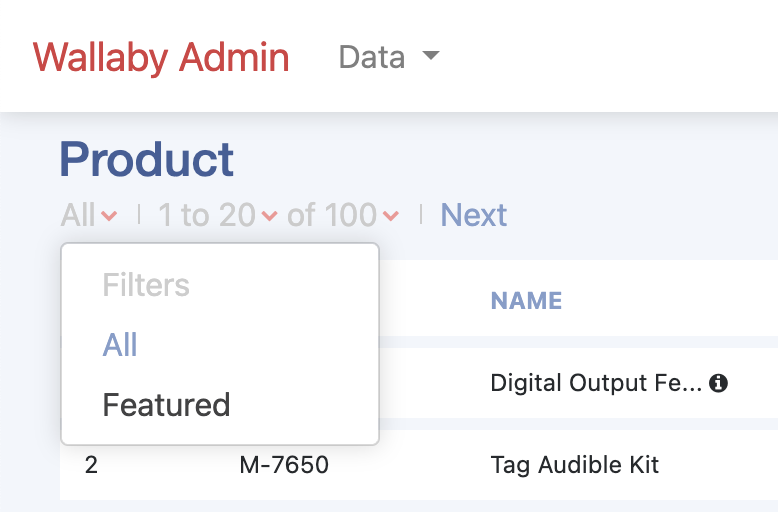

# Filters



If you want to add filters for index page as above, you can simply add a filter in the decorator as below:

```ruby
class Product < ApplicationRecord
  scope :featured, -> { where(featured: true) }
end

class Admin::ProductDecorator < Admin::ApplicationDecorator
  filters[:new_arrival] = {
    label: 'New arrival products',
    scope: -> { where(new_arrival: true) }
  }
end
```

## Options

The filter hash accepts two options:

### label

`label`: (optional) text to display in the filters dropdown.
    By default, if nothing is set, it will be set as the titleized string of the filter key symbol e.g. `"Featured"`

### scope

`scope`: (optional) scope for the corresponding ActiveRecord model e.g. `Product`. The value can be one of the followings:

  - omitted value. If nothing is set, it will just use the filter name as the scope name for the model. For example:

    ```ruby
    class Admin::ProductDecorator < Admin::ApplicationDecorator
      filters[:featured] = {} # means to use the scope `Product.featured`
    end
    ```

  - a symbol scope name from the model. For example:

    ```ruby
    class Admin::ProductDecorator < Admin::ApplicationDecorator
      filters[:highlighted] = {
        scope: :featured
      }
    end
    ```

  - a proc passing to the model. For example:

    ```ruby
    class Admin::ProductDecorator < Admin::ApplicationDecorator
      filters[:ordered_today] = {
        scope: -> { where(id: Order::Item.ordered_today.select(:product_id)) }
      }
    end
    ```
